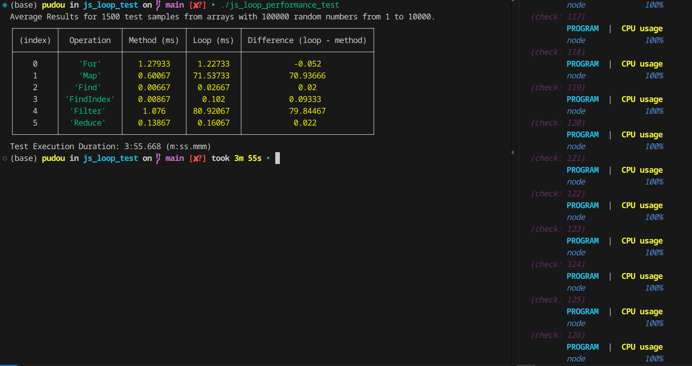
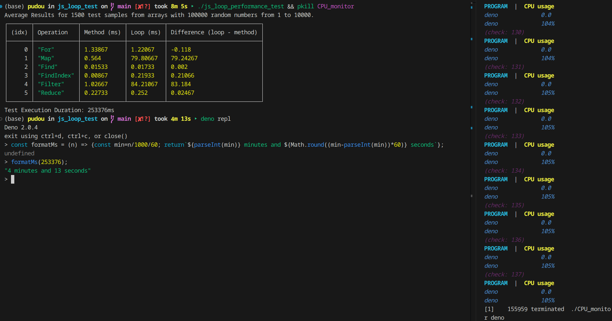
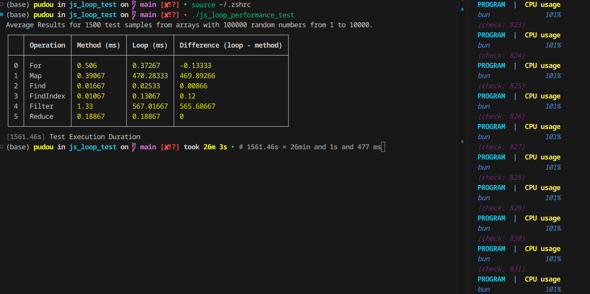
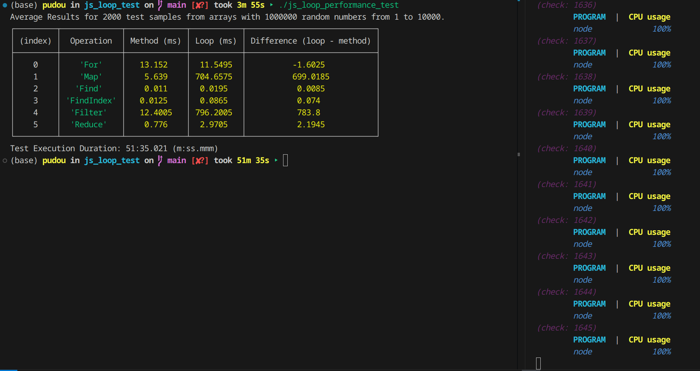
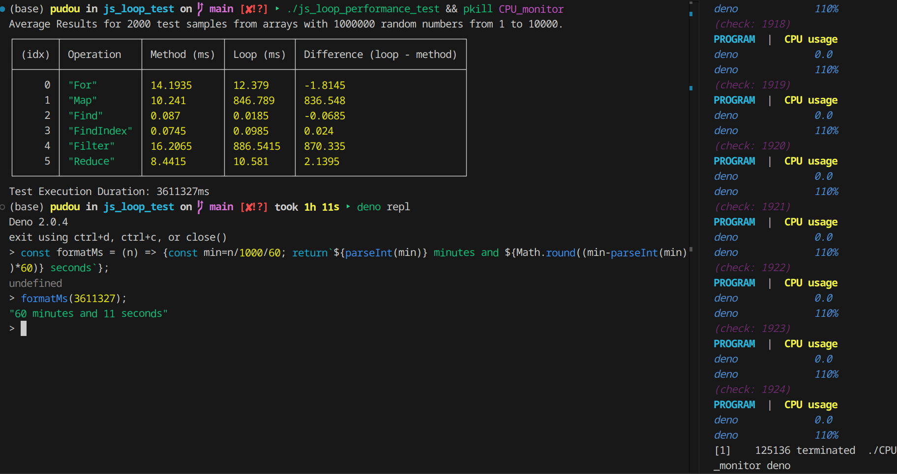

## JS LOOP PERFORMANCE TEST

> I was watching to a Primeagen's video with Chasey Muratori talking about performance, where Prime mentions that he avoid using JS array's map method because it creates a function (__reference__: *"[Clean Code : Horrible Performance | Full Interview](https://www.youtube.com/watch?v=OtozASk68Os&t=1428)" - amazing content, btw, where they were commenting about another amazing Muratori's [__video__](https://youtu.be/tD5NrevFtbU?si=RBWvaJyxWIs-NWD2))*.
>
> After that, I got curious. I've already seen other content that often mentions the contrary - that is, advises to avoid loops in JS when there is a builtin method for that use case. Based on that, I've created a simple test to check the actual difference between JS loops and its array builtin methods.

---

### About the JS Script

The script was written in such a way it could run in any JS runtime. As it took some few minutes to be written, I think the test is worth it. The `loopMap` function uses a pre-allocated array declared as global variable to avoid as much as possible either _1) any impact on its implementation with the first memory allocation of a huge array length_ __or__ _2) any JS runtime reallocation when using `.push`_. The intention was to test the loop approach itself. I couldn't do the same for `loopFilter` because the returned array size is not predictable.

The script basically agreggates lots of subsequent tests samples (1500 by default, be my guest to explode your CPU even more by changing the `iterations` value). So each method or loop performs 1500 tests with a long-sized array (100,000 by default - again, be my guest and change `arraySize` value). After processing, it shows a table with the results with the method, loop and the difference between them.

You just need to clone this repo and run `./js_loop_perfomance_test` (default runtime is `node`, change / delete the shebang value in order to test with different runtimes).

### Extra: Monitoring CPU Usage

In order to understand the maximum and viable amount of test samples that I could run to get more precise test results, I've also created a simple bash script to monitor CPU while tests are running. You just need to run it passing the process name as the first argument, like: `./CPU_monitor node` or `./CPU_monitor deno`. I've avoided using `watch` in order to keep track of the CPU usage changes. Once the test is done, type `ctrl + c` to stop the monitoring script.

### Results

Despite any lack of care in my implementations of the loop functions
that could have added more complexity than needed to it, the tests shows that using builtin methods is usually the best option. Only `.forEach` x `loopFor` showed a slight negative difference sometimes, while `.map` and `.filter` are much better than their loop counterparts than I would expect before actually test them.

1. Default Values (`iterations = 1500` and `arraySize = 100 000`):

    a) __Node.js__:

    </img>

    b) __Deno__:

    </img>

    c) __Bun__:

    </img>
    OMG Bun, does basic single-threaded sync processing scare you that much?

  <hue hue hue>

2. Bigger values and more samples (`iterations = 2000` and `arraySize = 1 000 000`)

    a) __Node.js__:
    
    </img>

    b) __Deno__:

    </img>
    
     
    
    _Since it meant to be a quick test and bun took 6x more time to run the default tests, I didn't test it with a higher load. Sorry Bun, you '[Alecrim Dourado](https://en.wiktionary.org/wiki/alecrim_dourado)' - **BRAZIL MENTIONED** - we'll call it a day._
